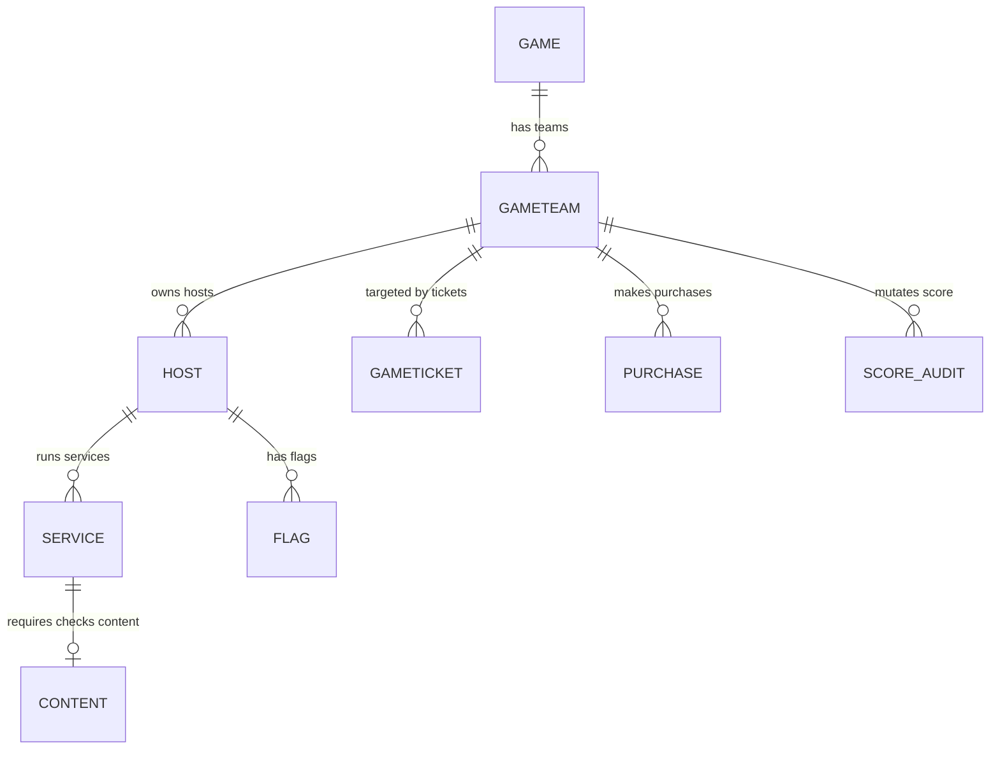

# Database Reference: Scorebot Core Lite

This document provides a comprehensive overview of the database architecture, schema models, backend configuration details, and application data patterns in Scorebot Core Lite.

---

## Supported Database Engines

Scorebot Core Lite uses **SQLAlchemy** (declarative mapping) to connect to database backends. The database engine configuration is dynamically determined by the `DATABASE_URL` environment variable.

### 1. SQLite Backend
By default, the application runs on a local SQLite file (`sqlite:///scorebot.db`). Because SQLite only supports one concurrent writer thread, the application executes optimized configuration commands on database connection:

* **WAL Mode (`journal_mode=WAL`)**: Promotes high-speed parallel reads and allows reader threads to access data without waiting for the writer thread to release locks.
* **Synchronous Normal (`synchronous=NORMAL`)**: Reduces sync write operations to the disk, relying on the filesystem cache for speed while preserving transaction safety under WAL mode.
* **Cache Size Optimization (`cache_size=-64000`)**: Allocates 64MB of memory cache to hold database page maps.
* **Immediate Transactions (`BEGIN IMMEDIATE`)**: Initiates transactions by locking write lanes up-front, eliminating lock-collision deadlocks between FastAPI threads and the background scheduler daemon thread.
* **Thread Safety Override (`check_same_thread=False`)**: Instructs the driver to share connection handlers across greenlets/FastAPI async threads.

### 2. Enterprise Databases (PostgreSQL / MySQL / MariaDB)
If `DATABASE_URL` does not start with `sqlite`, the initialization code switches to pool-based engine execution:

* **Connection Pool Size (`pool_size=15`)**: Allocates 15 persistent TCP sockets.
* **Max Overflow Pool (`max_overflow=25`)**: Allows the connection pool to temporarily expand by up to 25 sockets under extreme traffic spikes.
* **Pool Pre-Ping (`pool_pre_ping=True`)**: Automatically issues a test query (`SELECT 1`) to check if the connection socket is alive before routing a query, avoiding broken connection errors.
* **Connection Timeout (`pool_timeout=30`)**: Limits query waiting to 30 seconds before raising a pool starvation exception.

---

## ACID Compliance & Concurrency Control

Scorebot Core Lite is designed to support transactional ACID properties to ensure that scores, flag captures, and audit trails remain accurate under heavy concurrency:

### 1. Atomicity (All or Nothing)
Every gameplay mutation—such as a flag capture—involves multiple database operations (marking the flag captured, updating the attacker's score, deducting points from the victim, creating a `GameEvent`, and writing a `ScoreAudit` log).
* **Implementation**: Core Lite wraps these multi-step updates in SQLAlchemy session transaction contexts. If any step fails (e.g., database disconnect or validation error), the entire transaction is rolled back via `session.rollback()`. No partial scoring state is ever committed.

### 2. Consistency (State Validity)
The database enforces consistency using declarative relational constraints:
* Foreign Key cascades (`ondelete="CASCADE"`) guarantee that deleting a game cleanly purges teams, hosts, and services.
* Database-level schemas and constraint mappings (e.g., `UniqueConstraint` on store pricing overrides) ensure invalid records are rejected at the driver level.

### 3. Isolation (Independent Execution)
Concurrency in Core Lite is managed through database locks to prevent lost-update anomalies (e.g. a scoring round writing scores at the same time an API call records a flag capture):
* **SQLite WAL & Immediate Locking**: SQLite's standard isolation can lead to locking contentions (SQLITE_BUSY). To prevent this, Core Lite uses Write-Ahead Logging (WAL) and initiates write transactions using `BEGIN IMMEDIATE`. This locks the write lanes up-front, forcing concurrent API requests to wait sequentially while allowing parallel reads to continue unblocked.
* **SQLAlchemy Row Locking**: Critical endpoints (such as `capture_flag` in `flag.py`) and scoring checks (in `engine.py`) execute explicit row locks using SQLAlchemy's `.with_for_update()`. This locks the team and flag rows within the database transaction, preventing overlapping concurrent writes from overwriting score updates.
* **PostgreSQL / MySQL MVCC**: When using PostgreSQL, Multi-Version Concurrency Control (MVCC) provides robust snapshot isolation levels natively, allowing parallel processing without deadlocks.

### 4. Durability (Crash Survivability)
* **SQLite Durability**: Committed transactions are written to the Write-Ahead Log. The connection uses `PRAGMA synchronous=NORMAL`. This is safe against application-level crashes (e.g. process terminated or power cut to the app), though a sudden OS crash or hardware failure could result in losing the most recent un-synced database pages before they flush to disk. For environments where absolute hardware durability is required, configuration can be switched to `synchronous=FULL` (at the cost of slower write speeds).
* **PostgreSQL / MySQL Durability**: Fully guaranteed via write-ahead logging (WAL) and disk flushes (fsync) managed by the host database system.

---

## Database Selection Matrix

To help choose the right database backend for your deployment, consult this decision matrix:

| Use Case / Scenario | Recommended Database | Key Rationale |
| :--- | :--- | :--- |
| **Local Dev & Testing** | **SQLite** | Zero installation; fits inside the git repository workspace; fast schema rebuilds. |
| **Small-to-Medium Game**<br>(< 15 teams, < 100 hosts) | **SQLite (WAL Mode)** | Simple operation; avoids network latency between app and DB; optimized WAL reads easily handle small loads. |
| **Large Competition**<br>(> 15 teams, > 100 hosts) | **PostgreSQL** | Better concurrency support under heavy concurrent write operations; connection pool handling. |
| **High Availability Setup** | **PostgreSQL** | Allows hosting database clusters separately from the stateless API server processes. |
| **Shared Analytics Infrastructure**| **PostgreSQL** | Integrates natively with database analytics dashboards (e.g. Grafana) for real-time queries. |

### Rationale: Choosing PostgreSQL over MySQL / MariaDB

When scaling past SQLite, **PostgreSQL** is highly recommended over MySQL or MariaDB for the following reasons:

1. **Transactional Integrity & Locks**: PostgreSQL handles high concurrency with Multi-Version Concurrency Control (MVCC) and page/row locks more efficiently than MySQL under heavy writes (such as bulk flag submissions or scoring rounds writing audited history).
2. **Boolean and Array Type Mapping**: SQLAlchemy maps Python's boolean and JSON types seamlessly to PostgreSQL native datatypes (`BOOLEAN`, `JSONB`). MySQL maps boolean to `TINYINT(1)`, which sometimes requires specialized ORM mapping or casting in client code.
3. **Connection Pooling Efficiency**: PostgreSQL works very reliably with SQLAlchemy connection pools and external pgBouncer configurations, ensuring stable performance during sudden traffic surges without leaking network descriptors.

---

## Database Schema & ORM Models

The relational design is defined in `scorebot_core_lite/models.py`. The diagram below displays core relationships:



### Table Schema Definitions

#### 1. `games` (`Game` Model)
Represents the CTF competition instance. Holds timing metrics and configuration defaults.
* `id` (Integer, PK)
* `name` (String, Game Identifier)
* `start` / `finish` / `scored` (DateTime fields)
* `status` (Integer: 0=created, 1=running, 2=paused, 3=finished)
* `round_time` / `job_timeout` / `job_cleanup_time` (Integer configuration thresholds)
* `flag_stolen_rate` / `flag_captured_multiplier` / `beacon_value` / `ticket_cost` (Integer scoring parameters)

#### 2. `game_teams` (`GameTeam` Model)
Holds details about the competing groups.
* `id` (Integer, PK)
* `name` (String, Team Identifier)
* `subnet` (String CIDR e.g., `10.64.1.0/24`)
* `token` (String UUID used to submit flags and authorize client beacons)
* `score_flags` / `score_uptime` / `score_tickets` / `score_beacons` (Integer cached scores)
* `visible` (Boolean toggle for scoreboard display)

#### 3. `hosts` (`Host` Model)
Represents scored machines inside team subnets.
* `id` (Integer, PK)
* `fqdn` (String FQDN)
* `ip` (String IP address, mapped dynamically)
* `online` (Boolean status check)
* `purchasable` (Boolean: if true, host remains hidden until unlocked via the store)

#### 4. `services` (`Service` Model)
Individual open ports checked by the scoring daemon.
* `id` (Integer, PK)
* `port` (Integer)
* `name` / `application` (String e.g. "HTTP", "ssh")
* `protocol` (Integer: 1=TCP, 2=UDP)
* `status` (Integer: 0=up/green, 1=down/red, 2=timeout, 3=refused, 4=yellow)

#### 5. `contents` (`Content` Model)
Holds static JSON criteria verifying service content correctness.
* `id` (Integer, PK)
* `service_id` (Integer, FK -> services)
* `data` (Text payload representing expected response body or validation strings)

#### 6. `flags` (`Flag` Model)
Plants flag verification strings.
* `id` (Integer, PK)
* `flag` (String challenge signature)
* `value` (Integer point reward)
* `captured_team_id` (Integer, FK -> game_teams, Nullable until stolen)

#### 7. `game_tickets` (`GameTicket` Model)
Support/incident tickets opened by Gray/Gold teams targeting specific Blue Teams.
* `id` (Integer, PK)
* `closed` (Boolean)
* `total` (Integer points currently awarded or deducted)

#### 8. `purchases` (`Purchase` Model)
Store transactions logs.
* `id` (Integer, PK)
* `item` (String item name, e.g., `VM Deployment: webserver`)
* `amount` (Integer points spent)

#### 9. `game_compromises` & `game_compromise_hosts`
Beacon compromise mappings generated when red-team script check-ins succeed.
* `token` (String UUID associated with dynamic beacon deployment)
* `ip` (String IP location checking in)
* `checkin` (DateTime heartbeat tracker)

#### 10. `score_audits` / `score_histories` / `score_adjustments`
Logging records ensuring point updates can be audited.
* `source` (String label: `UPTIME`, `TICKET`, `FLAG`, `STORE`, `BEACON`, `ADJUSTMENT`)
* `amount` (Integer delta points)

---

## Database Application Code Patterns

### 1. Connection Session Lifecycle
FastAPI handles session injection using Dependency Injection. Database sessions are created per request and closed automatically on request teardown:

```python
from scorebot_core_lite.models import SessionLocal

def get_db():
    db = SessionLocal()
    try:
        yield db
    finally:
        db.close()
```

### 2. Startup Migrations
During lifespan startup, the application runs database-level schema synchronization (`init_db()` in `models.py`):
1. Runs SQLAlchemys `Base.metadata.create_all()` to build missing tables.
2. Performs best-effort `ALTER TABLE` operations to inject dynamic columns (such as `zero_out_time`, `beacon_time`, or `purchasable` flags) without breaking existing legacy SQLite schema files.

### 3. Event Listeners & Scoring Audits
Core Lite uses SQLAlchemy event hooks to bind database activity to system logs. For example, inserting a record into `ScoreAudit` triggers a listener logging the audit statement:

```python
@event.listens_for(ScoreAudit, 'after_insert')
def log_score_audit(mapper, connection, target):
    logger = logging.getLogger("scorebot_core_lite")
    logger.info(
        "SCORE_AUDIT: team_id=%s source=%s amount=%d desc=\"%s\"",
        target.team_id, target.source, target.amount, target.description or ""
    )
```
This guarantees scoring changes are logged to the standard application logs immediately, even if updates occur from automated daemon threads.
