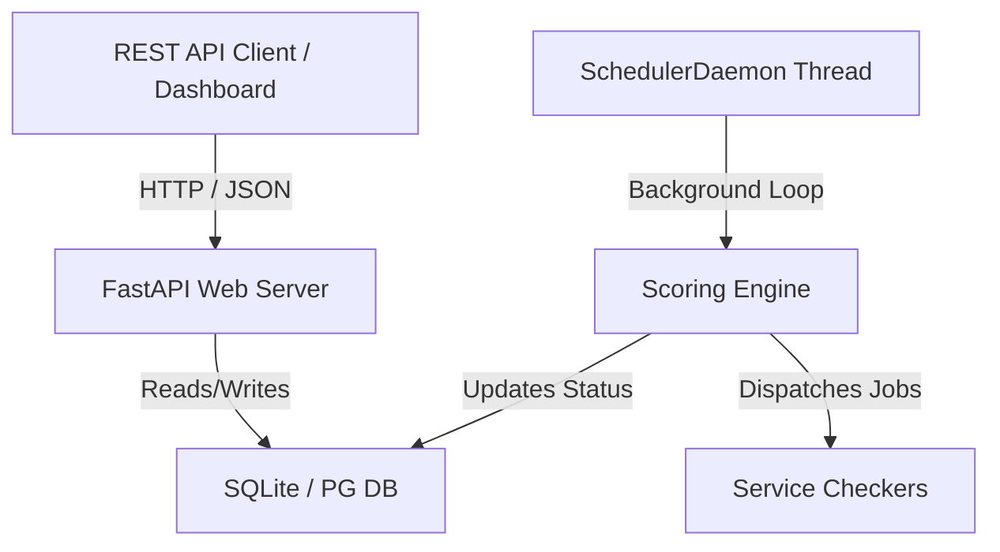

# Architecture Explanation: Scorebot Core Lite

This document covers the high-level architecture, design philosophy, and design decisions underpinning Scorebot Core Lite.

---

## Architecture Overview

Scorebot Core Lite is a streamlined, single-process, async-first port of the classic Scorebot Engine. It combines the web APIs, scoring logic scheduler, and admin dashboard into a single, cohesive Python package.

### The Async Web Server (FastAPI)
By utilizing FastAPI, Scorebot Core Lite benefits from standard ASGI performance, asynchronous request-handling (using `asynccontextmanager` lifespans), and automatic documentation (OpenAPI schema generation). It manages gameplay interactions, admin requests, and real-time scoreboard serialization.

### The Background Scheduler (`SchedulerDaemon`)
Rather than relying on cron, Celery, or external job managers, Core Lite operates a dedicated `SchedulerDaemon` thread (defined in `scoring/scheduler.py`).
1. **Lifecycle Integration**: On application startup, FastAPI's `lifespan` hook spawns the daemon. On shutdown, it stops gracefully.
2. **Loop Execution**: The daemon polls active games, calculates round progression based on the game's `round_time` setting, and triggers the `scoring/engine.py` processing cycle.
3. **Execution Safety**: The daemon isolates job scheduling from the main ASGI request/response loop, ensuring API operations remain responsive even during heavy scoring execution runs.

---

## Database Design & SQLite Optimization

One of the largest departures from the original Scorebot architecture is the prioritization of **SQLite** as the default relational storage backend. To prevent database locks (`database is locked` error) while writing logs and updating scores concurrently, Core Lite configures several SQLite PRAGMAs (see `models.py` set_sqlite_pragma):

### 1. Write-Ahead Logging (WAL) Mode
`PRAGMA journal_mode=WAL`
* **Why**: By default, SQLite lock-guards updates. WAL mode permits multiple reader connections to coexist with a single writer thread concurrently. Reads bypass the database file directly, reading from a shared-memory WAL index, which reduces I/O wait times.

### 2. Immediate Transactions
`BEGIN IMMEDIATE`
* **Why**: Standard transactions postpone acquiring write locks until the first write query occurs. In a multi-threaded daemon context, this delay can lead to deadlock errors (SQLITE_BUSY) if two operations attempt updates concurrently. `BEGIN IMMEDIATE` forces write-locks to be acquired up-front, organizing concurrent queries sequentially.

---

## Configuration Ingestion Strategy

Core Lite supports two configuration sources via `ingest.py`:

1. **REST JSON Database Ingestion (CI/CD Pipeline)**:
   The REST endpoint `/api/admin/games/import` receives a compiled, base64+gzip JSON database from your game definitions CI process. The FastAPI endpoint parses the structure, resolves VM and role dependencies on-the-fly, and inserts host/service specifications.
2. **On-Disk Directory Ingestion (Fallback/Local)**:
   For offline or development environments, `ingest.py` reads JSON definitions from a local directory (specified by `GAME_DEFINITIONS_PATH`). This allows developers to run, iterate on, and test game definitions without requiring CI orchestrators.
