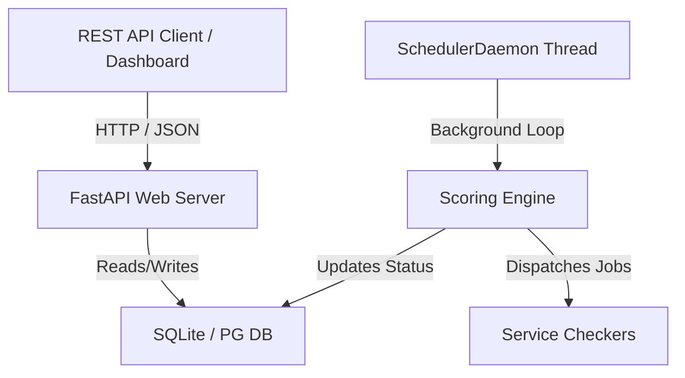

# Architecture Explanation: Scorebot Core Lite

This document covers the high-level architecture, design philosophy, and design decisions underpinning Scorebot Core Lite.

---

## Architecture Overview

Scorebot Core Lite is a streamlined, single-process, async-first port of the classic Scorebot Engine. It combines the web APIs, scoring logic scheduler, and admin dashboard into a single, cohesive Python package.

### The Async Web Server (FastAPI)
By utilizing FastAPI, Scorebot Core Lite benefits from standard ASGI performance, asynchronous request-handling (using `asynccontextmanager` lifespans), and automatic documentation (OpenAPI schema generation). It manages gameplay interactions, admin requests, and real-time scoreboard serialization.

### The Background Scheduler (`SchedulerDaemon`)
Rather than relying on external process orchestration (like the classic standalone `daemon.py`), cron, or external job managers, Core Lite operates a dedicated `SchedulerDaemon` thread (defined in `scoring/scheduler.py`).
1. **Lifecycle Integration**: On application startup, FastAPI's `lifespan` hook spawns the daemon. On shutdown, it stops gracefully.
2. **Loop Execution**: The daemon polls active games, calculates round progression based on the game's `round_time` setting, and triggers the `scoring/engine.py` processing cycle.
3. **Execution Safety**: The daemon isolates job scheduling from the main ASGI request/response loop, ensuring API operations remain responsive even during heavy scoring execution runs.

---

## Database Design: Production PostgreSQL & Local SQLite

Scorebot Core Lite is designed to run in production with a high-performance **PostgreSQL** backend, while allowing developers to spin up the application offline or locally using **SQLite**.

### 1. Production Database: PostgreSQL
In a live range environment, PostgreSQL handles multi-client concurrent transactions securely and robustly. SQLAlchemy is configured with optimized connection pooling (see `models.py`):
* **Connection Pooling (`pool_size=15`, `max_overflow=25`)**: Maintains a pool of ready-to-use connections to reduce TCP handshake overhead. Under load bursts, it dynamically overflows up to 25 additional connections.
* **Pre-Ping (`pool_pre_ping=True`)**: Executes a simple test query (like `SELECT 1`) on checked-out connections to detect stale or closed socket connections, preventing API crashes due to database drops.
* **Timeout (`pool_timeout=30`)**: Limits the maximum wait time for acquiring an available connection from the pool before throwing a timeout exception.

### 2. Local Development Fallback: SQLite Optimization
To prevent locks (`database is locked` error) while developers run, iterate on, and test game configurations locally, Core Lite configures custom SQLite connection PRAGMAs:
* **Write-Ahead Logging (WAL) Mode (`PRAGMA journal_mode=WAL`)**: Allows concurrent reads from a shared-memory index file while writes append to a separate WAL log, eliminating read-blocking during writes.
* **Immediate Transactions (`BEGIN IMMEDIATE`)**: Forces SQLite transactions to acquire write locks up front, preventing deadlocks when multi-threaded background scorers and local API requests write concurrently.

---

## The Async Architecture Change

Scorebot Core Lite shifts the original Scorebot Core framework from a synchronous Django-based monolith to a modern, asynchronous, lightweight ASGI stack using **FastAPI** and **SQLAlchemy**.

### 1. Rationale
The classic Scorebot Core relied on a multi-tier structure: Django (running synchronously under Gunicorn/WSGI), a separate standalone loop daemon (`daemon.py`) for running background scoring and cleanup checks, and a relational database (typically MySQL or PostgreSQL). While functional, this design required managing multiple processes and configuring a heavy relational database server (like MySQL), which was overly complex and resource-intensive for standard, localized CTF exercises and range deployments.
* **Simplification**: Managing separate WSGI and daemon runtimes (often managed via screens or custom process scripts) created operational overhead.
* **Resource Optimization**: Small-scale or dynamic ranges need to run on tiny footprints (e.g., lightweight VMs or Docker containers).
* **GitOps Alignment**: Modern CTF infrastructure benefits from a direct, API-driven configuration model rather than running management commands inside containers or executing migrations manually.

### 2. Benefits of the Async Transition
* **I/O Performance & Concurrency**: FastAPI utilizes Python's `asyncio` and ASGI standard to handle hundreds of concurrent requests (such as beacon check-ins and flag capture posts) without blocking. While a synchronous worker blocks on each network or database wait, the async event loop continues processing other incoming requests.
* **Unified Single-Process Lifecycle**: Scoring scheduling, cleanup loops, and web endpoints run inside a single Python process. By leveraging FastAPI's `lifespan` manager, the background daemon thread starts and stops gracefully with the web server.
* **Developer Ergonomics**: Decoupling routes into lightweight FastAPI APIRouters provides automatic OpenAPI schemas (Swagger UI), validation via Pydantic, and cleaner dependecy injection patterns.

### 3. Pros and Cons of Core Lite's Architecture

#### Pros
* **Ultra-Low Footprint**: Standard deployment runs as a single Python process requiring less than 100MB of RAM.
* **Flexible Database Backends**: Designed around SQLAlchemy, the system easily scales from local development SQLite files to highly concurrent production **PostgreSQL** deployments by changing a single environment variable.
* **High Production Concurrency**: In PostgreSQL mode, the system handles concurrent reads and writes seamlessly using row-level locking and SQLAlchemy connection pooling, preventing bottlenecks.
* **API-First Ingestion**: Decoupling the game configurations allows range orchestrators to deploy and update targets via direct JSON API requests.

#### Cons
* **GIL & CPU Bottlenecks**: Python's Global Interpreter Lock (GIL) means CPU-heavy tasks—such as massive JSON serialization for large scoreboard payloads or intensive metric computations—can occasionally block the event loop, causing slight latency spikes for concurrent network connections.
* **Connection Limits**: In massive PostgreSQL environments, the database connection pool size must be carefully sized (`pool_size`) to avoid database socket exhaustion when scaling the web application across multiple nodes.
* **Async/Sync Complexity**: SQLAlchemy calls in the async endpoints run synchronously or require connection threading, necessitating careful session management (e.g., committing transactions, closing connections, and avoiding session sharing across threads).

---

## Configuration Ingestion Strategy

Core Lite supports two configuration sources via `ingest.py`:

1. **REST JSON Database Ingestion (CI/CD Pipeline)**:
   The REST endpoint `/api/admin/games/import` receives a compiled, base64+gzip JSON database from your game definitions CI process. The FastAPI endpoint parses the structure, resolves VM and role dependencies on-the-fly, and inserts host/service specifications.
2. **On-Disk Directory Ingestion (Fallback/Local)**:
   For offline or development environments, `ingest.py` reads JSON definitions from a local directory (specified by `GAME_DEFINITIONS_PATH`). This allows developers to run, iterate on, and test game definitions without requiring CI orchestrators.
